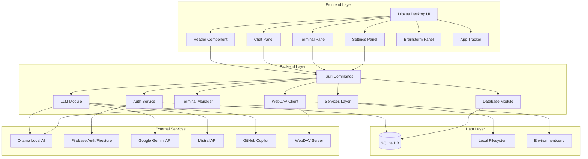

# Kael-OS-AI Architecture

## System Overview

Kael-OS-AI is an AI-native desktop application built with Rust, Dioxus, and Tauri. It provides a unified interface for interacting with multiple AI providers (local and cloud), integrated terminal functionality, and project management capabilities. The application is designed with an offline-first architecture, using SQLite for local storage with optional Firebase synchronization.

### Key Design Principles

- **Offline-First**: Core functionality works without internet connectivity
- **Pure Rust**: No Node.js/npm dependencies, fully self-contained binary
- **Modular Architecture**: Clean separation between UI, backend, and services
- **Security-Focused**: Encrypted API key storage, secure OAuth flows
- **Performance**: Native performance with optimized Rust backend

## Architecture Diagram



## Core Components

### 1. Frontend Layer (Dioxus Desktop)

#### UI Framework

- **Dioxus**: Rust-native reactive UI framework
- **Component-based architecture**: Reusable, composable components
- **State management**: Signal-based reactivity with `use_signal`
- **Styling**: Inline CSS with custom "forge palette" theme

#### Key Components

##### App Component (`components/app.rs`)

- Main application container
- Manages global state (auth, terminal, chat)
- Handles system context initialization
- Coordinates between panels

##### Header Component

- Application branding (Kael sigil)
- User authentication status
- Quick actions and navigation

##### Chat Panel

- Multi-provider AI chat interface
- Message history management
- Streaming response support
- Hybrid mode (local + cloud)

##### Terminal Panel

- PTY-based terminal emulation
- Command execution and output streaming
- Arch Linux package manager translations
- History and autocomplete

##### Settings Panel

- API key management (encrypted)
- Provider configuration
- Theme and preference settings
- Firebase OAuth setup

##### Brainstorm Panel

- Collaborative AI brainstorming
- Structured idea generation
- Export capabilities

##### App Tracker

- Project/app status tracking
- Status categories (Want, Making, Testing, Complete)
- Firebase sync for project data

### 2. Backend Layer (Rust/Tauri)

#### Tauri IPC Bridge (`commands.rs`)

All frontend-backend communication flows through Tauri commands:

- **Chat Commands**: `send_message`, `get_chat_history`
- **Auth Commands**: `initiate_oauth`, `get_oauth_url`, `oauth_result`
- **Terminal Commands**: `execute_terminal_command`, `execute_script`
- **Config Commands**: `get_kael_config`, `save_kael_config`
- **WebDAV Commands**: File upload/download operations
- **Version Commands**: Update checking and version management

#### Authentication Module (`auth.rs`)

**AuthService**

- User session management
- OAuth flow coordination (Google, GitHub)
- Token refresh and expiration handling
- Local user data persistence

**Encryption**

- XOR-based encryption using user's ID token as key
- API key encryption for secure storage
- Base64 encoding for transport

**User Model**

```rust
struct User {
    uid: String,
    email: String,
    name: String,
    photo_url: Option<String>,
    id_token: String,
    refresh_token: Option<String>,
    expires_in: Option<i64>,
}
```

#### LLM Module (`llm.rs`)

**Provider Support**

- Local: Ollama (offline operation)
- Cloud: Gemini, Mistral, GitHub Copilot, Minstrel, Office365AI, GoogleOneAI

**Request/Response Flow**

```rust
LLMRequest {
    provider: LLMProvider,
    model: String,
    prompt: String,
    api_key: Option<String>,
    system: Option<String>,
}
→ send_request_with_fallback()
→ LLMResponse {
    provider: LLMProvider,
    content: String,
}
```

**Fallback Chain**

1. Try initial provider
2. On failure, iterate through enabled providers
3. Return first successful response
4. Local Ollama as last resort

**Model Selection**

- Auto-detect installed Ollama models
- Environment variable overrides
- Provider-specific defaults
- Priority: llama > phi > mistral > qwen > granite > gemma

#### Terminal Module (`terminal/mod.rs`)

**TerminalManager**

- Synchronous command execution
- Sudo support with password input
- Shell integration (`/bin/sh -c`)

**PtyTerminal** (from `kael-terminal` crate)

- Full PTY (pseudo-terminal) emulation
- Streaming output
- Interactive shell sessions
- Background process management

#### Database Module (`db/mod.rs`)

**SQLite Schema**

```sql
CREATE TABLE chat_messages (
    id TEXT PRIMARY KEY,
    role TEXT NOT NULL,
    text TEXT NOT NULL,
    timestamp TEXT NOT NULL,
    synced INTEGER DEFAULT 0
);
```

**Operations**

- `init_db()`: Database initialization with WAL mode
- `add_message()`: Store chat messages with UUID
- `get_chat_history()`: Retrieve chronological message history
- Migrations system for schema evolution

**Storage Location**

- App data directory (platform-specific)
- WAL mode for better concurrency
- Automatic migration on startup

#### WebDAV Module (`webdav/mod.rs`)

**WebDavClient**

- HTTP-based file transfer
- Basic authentication
- PROPFIND protocol support

**Operations**

- `upload_file()`: Upload local files to server
- `download_file()`: Fetch files from server
- `create_directory()`: MKCOL method
- `delete_file()`: DELETE method
- `list_directory()`: PROPFIND directory listing

**Use Cases**

- Deployment to cPanel hosting
- Remote backup
- Artifact distribution

### 3. Services Layer

#### System Context Service (`services/system_context.rs`)

- Hardware detection (CPU, RAM, GPU)
- Software detection (OS, Ollama models)
- First-launch context creation
- Persistent context storage

#### Ollama Manager (`services/ollama_manager.rs`)

- Check Ollama installation and status
- Start Ollama service automatically
- Model availability detection
- Health checking

#### Local AI Startup (`services/local_ai_startup.rs`)

- Comprehensive local AI initialization
- System capability detection
- Model warming (reduce first-request latency)
- Startup status reporting

#### Command Rewriter (`services/command_rewriter.rs`)

- Translate generic commands to Arch Linux equivalents
- Package manager translation (apt→pacman, brew→paru)
- Smart command suggestions

#### Brainstorm Service (`services/brainstorm.rs`)

- Structured brainstorming workflows
- AI-assisted idea generation
- Export and persistence

#### GPG Backup Service (`services/gpg_backup.rs`)

- Encrypted backup creation
- GPG key management
- Secure configuration export

### 4. Firebase Integration (Optional)

**Authentication**

- Google OAuth via Firebase
- GitHub OAuth via Firebase
- Token management and refresh

**Firestore**

- API key synchronization
- Project/app tracker sync
- Chat history backup (optional)

**Firebase Uploader**

- Artifact deployment
- Configuration sync
- Release distribution

### 5. Crypto Module (`crypto/mod.rs`)

**Capabilities**

- AES-GCM encryption
- PBKDF2 key derivation
- HMAC signatures
- Random number generation
- X.509 certificate generation (rcgen)
- TLS support (rustls)

## Data Flow

### Chat Message Flow

```
User Input (Frontend)
    ↓
Chat Component (Dioxus)
    ↓
Tauri Command (send_message)
    ↓
LLM Module
    ├→ Check hybrid mode setting
    ├→ Select provider (local/cloud)
    ├→ Fetch API key (if cloud)
    ├→ Send request with fallback
    │   ├→ Try primary provider
    │   └→ Fall back to others on failure
    ↓
LLMResponse
    ↓
Database (add_message)
    ↓
UI Update (reactive signal)
    ↓
Display to User
```

### Authentication Flow

```
User Clicks Login
    ↓
Settings Component
    ↓
Tauri Command (initiate_oauth)
    ↓
OAuth Server (port 5173)
    ↓
External OAuth Provider (Google/GitHub)
    ↓
OAuth Callback
    ↓
Parse Tokens
    ↓
Create User Object
    ↓
Save to Local Storage
    ↓
AuthService Update
    ↓
UI Refresh (show user info)
    ↓
Prefetch Provider Keys (background)
```

### Terminal Command Flow

```
User Types Command
    ↓
Terminal Component
    ↓
PTY Terminal Instance
    ↓
Fork PTY Process
    ↓
Execute in Shell (/bin/sh)
    ↓
Stream Output
    ↓
ANSI Escape Stripping
    ↓
UI Update (reactive)
    ↓
Display Output
```

## Technology Stack

### Core Technologies

- **Language**: Rust 2021 Edition
- **UI Framework**: Dioxus 0.5
- **Desktop Framework**: Tauri 2.1
- **Database**: SQLite 3 with rusqlite 0.31
- **Async Runtime**: Tokio 1.x

### Key Dependencies

**UI & Desktop**

- `dioxus = "0.5"` - Reactive UI framework
- `dioxus-desktop = "0.5"` - Desktop renderer
- `tauri = "2.1"` - Desktop app framework
- `tao = "0.26"` - Window management

**Data & Serialization**

- `serde = { version = "1.0", features = ["derive"] }`
- `serde_json = "1.0"`
- `rusqlite = { version = "0.31", features = ["bundled", "chrono"] }`
- `chrono = { version = "0.4", features = ["serde"] }`
- `uuid = { version = "1.11", features = ["v4", "serde"] }`

**Networking**

- `reqwest = { version = "0.11", features = ["json"] }`
- `url = "2.5"`
- `urlencoding = "2.1"`

**Cryptography**

- `aes-gcm = "0.10"` - AES-GCM encryption
- `pbkdf2 = "0.12"` - Password-based key derivation
- `sha2 = "0.10"` - SHA-2 hashing
- `hmac = "0.12"` - HMAC authentication
- `rand = "0.8"` - Random number generation
- `rcgen = "0.12"` - Certificate generation
- `rustls = "0.21"` - TLS implementation

**Utilities**

- `base64 = "0.22"`
- `regex = "1.10"`
- `once_cell = "1.19"`
- `num_cpus = "1.16"`
- `sysinfo = "0.30"`
- `arboard = "3"` - Clipboard access
- `open = "5"` - Open URLs/files
- `dotenv = "0.15"` - Environment variables

**Internal Crates**

- `kael-terminal` - PTY terminal emulation

## Module Structure

```
src-tauri/src/
├── main.rs                    # Application entry point
├── app_scaffold.rs            # App project templates
├── auth.rs                    # Authentication & user management
├── commands.rs                # Tauri IPC commands
├── llm.rs                     # Multi-provider LLM interface
├── oauth_server.rs            # OAuth callback server
├── state.rs                   # Global application state
├── version.rs                 # Version checking and updates
├── webview_oauth.rs           # WebView-based OAuth
├── components/                # Dioxus UI components
│   ├── mod.rs
│   ├── app.rs                 # Main application component
│   ├── header.rs              # Header with branding
│   ├── chat.rs                # Chat interface
│   ├── terminal.rs            # Terminal emulator
│   ├── settings.rs            # Settings panel
│   ├── brainstorm.rs          # Brainstorm panel
│   ├── app_tracker.rs         # Project tracker
│   ├── api_key_manager.rs     # API key management
│   ├── icons.rs               # Icon components
│   └── ...
├── db/                        # Database layer
│   ├── mod.rs
│   └── migrations.rs          # Schema migrations
├── terminal/                  # Terminal implementation
│   ├── mod.rs
│   └── pty_manager.rs         # PTY management
├── services/                  # Business logic services
│   ├── mod.rs
│   ├── system_context.rs      # System detection
│   ├── ollama_manager.rs      # Ollama service management
│   ├── local_ai_startup.rs    # Local AI initialization
│   ├── command_rewriter.rs    # Command translation
│   ├── brainstorm.rs          # Brainstorming logic
│   ├── app_projects.rs        # Project management
│   ├── first_launch.rs        # First-run setup
│   └── gpg_backup.rs          # Encrypted backups
├── api/                       # External API handlers
│   ├── mod.rs
│   └── handlers.rs
├── firebase/                  # Firebase integration
│   ├── mod.rs
│   └── uploader.rs
├── github/                    # GitHub integration
│   ├── mod.rs
│   └── uploader.rs
├── webdav/                    # WebDAV client
│   └── mod.rs
├── crypto/                    # Cryptography utilities
│   └── mod.rs
├── ssl/                       # SSL/TLS utilities
│   └── mod.rs
├── gpg/                       # GPG operations
│   └── mod.rs
└── updater/                   # Auto-update functionality
    └── mod.rs
```

## Build System

### Cargo Profiles

#### Development Profile

```toml
[profile.dev]
opt-level = 0      # No optimization
debug = true       # Keep debug symbols
```

- Fast compilation (~2.6 seconds)
- Large binary size
- Full debugging capabilities

#### Release Profile

```toml
[profile.release]
opt-level = 3      # Maximum optimization
lto = true         # Link-time optimization
codegen-units = 1  # Single codegen unit
strip = true       # Strip symbols
panic = "abort"    # Abort on panic
```

- Compilation time: ~1m 24s
- Binary size: **19 MB**
- Maximum performance
- Fully optimized and stripped

#### Minimal Release Profile

```toml
[profile.release-minimal]
inherits = "release"
opt-level = "z"    # Optimize for size
lto = "fat"        # Aggressive LTO
```

- Smallest possible binary
- Some performance trade-offs
- Ideal for distribution

### Build Process

```bash
# Development build (fast iteration)
cargo build

# Release build (production)
cargo build --release

# Minimal build (smallest binary)
cargo build --profile release-minimal

# Run in development
cargo run

# Run with logging
RUST_LOG=debug cargo run
```

### Build Optimizations

1. **LTO (Link-Time Optimization)**

   - Cross-crate inlining
   - Dead code elimination
   - Whole-program optimization

2. **Single Codegen Unit**

   - Better optimization opportunities
   - Slower compilation
   - Smaller, faster binary

3. **Symbol Stripping**

   - Remove debug symbols
   - Reduce binary size
   - No debugging impact (release builds)

4. **Panic Abort**

   - Remove unwinding code
   - Smaller binary
   - Faster panic handling

5. **Bundled SQLite**
   - No external dependencies
   - Fully self-contained
   - Consistent across platforms

## Security Architecture

### API Key Management

**Storage**

```
~/.local/share/kael-os/
├── user.json           # Encrypted user session
├── api_keys.json       # Encrypted API keys
└── kael.db            # SQLite database
```

**Encryption Flow**

```
Plaintext API Key
    ↓
XOR Encryption (using user ID token)
    ↓
Base64 Encoding
    ↓
Store in Local File
    ↓
(On retrieval)
    ↓
Base64 Decode
    ↓
XOR Decryption
    ↓
Plaintext API Key (in memory only)
```

### Authentication Security

**OAuth Flow**

1. User initiates login
2. Open OAuth provider URL
3. User authenticates externally
4. Callback to local server (localhost:5173)
5. Exchange code for tokens
6. Store encrypted tokens locally
7. Automatic token refresh before expiration

**Token Management**

- ID tokens stored encrypted
- Refresh tokens for long-term sessions
- Automatic expiration checking (5 min buffer)
- Secure local storage only

### Network Security

**TLS/SSL**

- All external API calls over HTTPS
- Certificate validation
- rustls for pure-Rust TLS

**API Key Transmission**

- Never stored in plaintext
- In-memory only during requests
- Cleared after use

### Filesystem Security

**Permissions**

- User data directory: `700` (owner only)
- Database file: `600` (owner read/write only)
- API key file: `600` (owner read/write only)

**Backup Encryption**

- GPG-encrypted backups
- Configurable encryption keys
- Secure key storage

## Performance Considerations

### Binary Size

- **Production build**: 19 MB (self-contained)
- Includes: Rust runtime, SQLite, crypto libraries, terminal emulation, UI
- Zero external dependencies

### Startup Time

- System context detection: ~100-500ms
- Ollama service check: ~50ms
- Database initialization: ~10ms
- UI render: ~100ms
- **Total cold start**: ~500-800ms

### Memory Usage

- Base application: ~50-80 MB
- Per chat session: +5-10 MB
- Terminal PTY: +10-20 MB per instance
- LLM streaming: +20-50 MB during active requests

### Optimization Strategies

1. **Lazy Loading**

   - Components load on demand
   - Services initialize when first used
   - Deferred system context detection

2. **Caching**

   - API keys cached after first fetch
   - System context persisted
   - Ollama model list cached

3. **Streaming**

   - LLM responses stream to UI
   - Terminal output streams in real-time
   - No buffering delays

4. **Async/Await**
   - Non-blocking network requests
   - Concurrent service initialization
   - Responsive UI during operations

## Deployment Architecture

### Single Binary Distribution

- One executable file
- No installers required
- No runtime dependencies (except system libs)

### Platform Support

- **Linux**: Primary target (Arch Linux optimized)
- **macOS**: Supported via Tauri
- **Windows**: Supported via Tauri

### System Requirements

- **OS**: Linux (glibc 2.31+), macOS 10.15+, Windows 10+
- **RAM**: 512 MB minimum, 2 GB recommended
- **Disk**: 50 MB for application, +storage for chat history
- **Optional**: Ollama for local AI (700+ MB)

### Distribution Methods

1. **Direct Download**: Single binary from website
2. **GitHub Releases**: Automated builds for all platforms
3. **WebDAV**: Self-hosted distribution
4. **Firebase Storage**: Cloud distribution
5. **AUR (Arch Linux)**: PKGBUILD for package manager

## Future Architecture Considerations

### Scalability

- Plugin system for new LLM providers
- Extension API for custom components
- Modular service architecture

### Multi-User Support

- User isolation in database
- Per-user configuration
- Shared system context

### Cloud Sync

- Optional Firestore full sync
- Conflict resolution
- Offline-first with eventual consistency

### Mobile Support

- React Native frontend (shared Rust backend)
- Platform-specific builds
- Cloud sync for cross-device

---

**Document Version**: 1.0  
**Last Updated**: December 16, 2025  
**Project**: Kael-OS-AI v1.0.0
